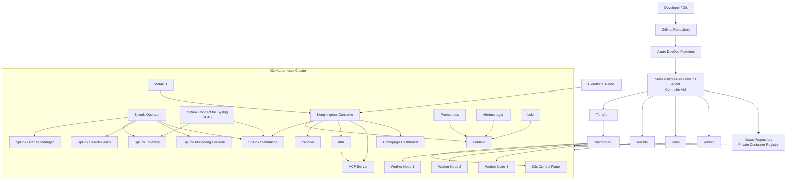
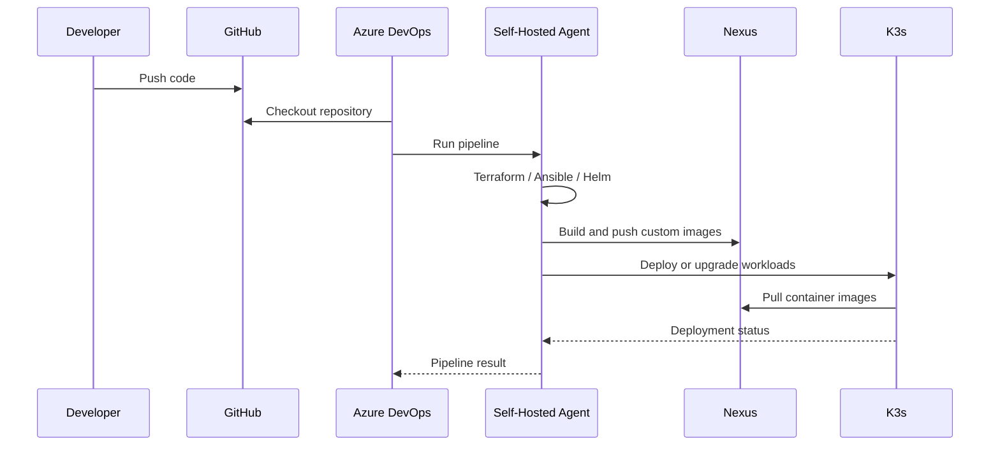
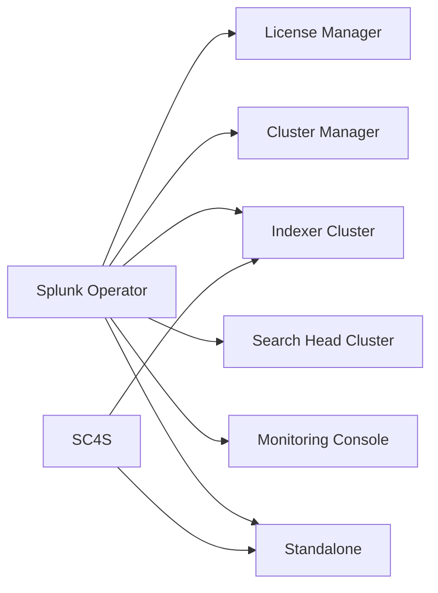

# Architecture

This document describes the architecture of the **DevSecOps Splunk Lab**, a Kubernetes-based homelab designed to automate Splunk infrastructure and supporting services using Infrastructure as Code and CI/CD.

## High-Level Architecture



---

## CI/CD Flow



---

## Infrastructure Layer

The lab runs on **Proxmox VE**.

Terraform provisions the virtual machines used by the Kubernetes environment.

```text
Proxmox VE
│
├── Controller VM
│   ├── Azure DevOps Agent
│   ├── Terraform
│   ├── Ansible
│   ├── Helm
│   ├── kubectl
│   └── Docker
│
└── K3s Cluster
    ├── Control Plane
    ├── Worker 1
    ├── Worker 2
    └── Worker 3
```

---

## Splunk Architecture

Splunk Enterprise workloads are managed using the **Splunk Operator for Kubernetes**.



The repository contains deployment automation for several Splunk architectures, allowing the lab to evolve from a standalone deployment toward clustered Splunk components.

---

## Networking

The Kubernetes networking stack uses:

- **MetalLB** for LoadBalancer IP allocation
- **Kong** as the Kubernetes ingress controller
- **Cloudflare Tunnel** for selected external access
- Kubernetes `ClusterIP`, `LoadBalancer`, and ingress services

```text
Internet / External Access
          |
    Cloudflare Tunnel
          |
          v
     Kong Ingress
          |
    +-----+------+-------+-------+
    |            |       |       |
 Splunk       Grafana   n8n   Rancher
```

---

## Observability

The monitoring stack includes:

```text
Prometheus
    |
    +--> Grafana
    |
Alertmanager
    |
    +--> Grafana

Loki
    |
    +--> Grafana
```

Splunk provides security analytics and centralized log ingestion, while the Prometheus/Grafana stack provides Kubernetes and infrastructure observability.

---

## Container Registry

**Nexus Repository** is used as the private container registry.

Example deployment flow:

```text
Azure DevOps Pipeline
        |
        v
 Docker Build
        |
        v
 Nexus Repository
        |
        v
 K3s Deployment
```

Custom workloads such as the n8n MCP-enabled image are built by the self-hosted Azure DevOps agent and pushed to Nexus before deployment.

---

## Automation Layers

| Layer | Technology | Responsibility |
|---|---|---|
| Virtualization | Proxmox VE | VM hosting |
| Provisioning | Terraform | VM lifecycle |
| Configuration | Ansible | OS and application deployment |
| Orchestration | K3s | Container orchestration |
| Packaging | Helm | Kubernetes application deployment |
| CI/CD | Azure DevOps | Pipeline automation |
| Source Control | GitHub | Version control |
| Registry | Nexus Repository | Private container images |
| SIEM | Splunk Enterprise | Security analytics and log management |
| Syslog | SC4S | Syslog collection and normalization |
| Ingress | Kong | HTTP/HTTPS routing |
| Load Balancer | MetalLB | Kubernetes LoadBalancer services |
| Monitoring | Prometheus / Grafana | Platform observability |
| Automation | n8n | Workflow automation |
| AI Integration | MCP Server | Kubernetes / automation integration |

---

## Design Goals

The lab is designed to demonstrate:

- Infrastructure as Code
- Kubernetes administration
- Splunk infrastructure engineering
- CI/CD automation
- Configuration management
- Container registry management
- Observability
- DevSecOps practices
- Security automation
- AI/MCP integration

This environment is intended for **learning, testing, experimentation, and technical demonstrations**, not direct production deployment.
